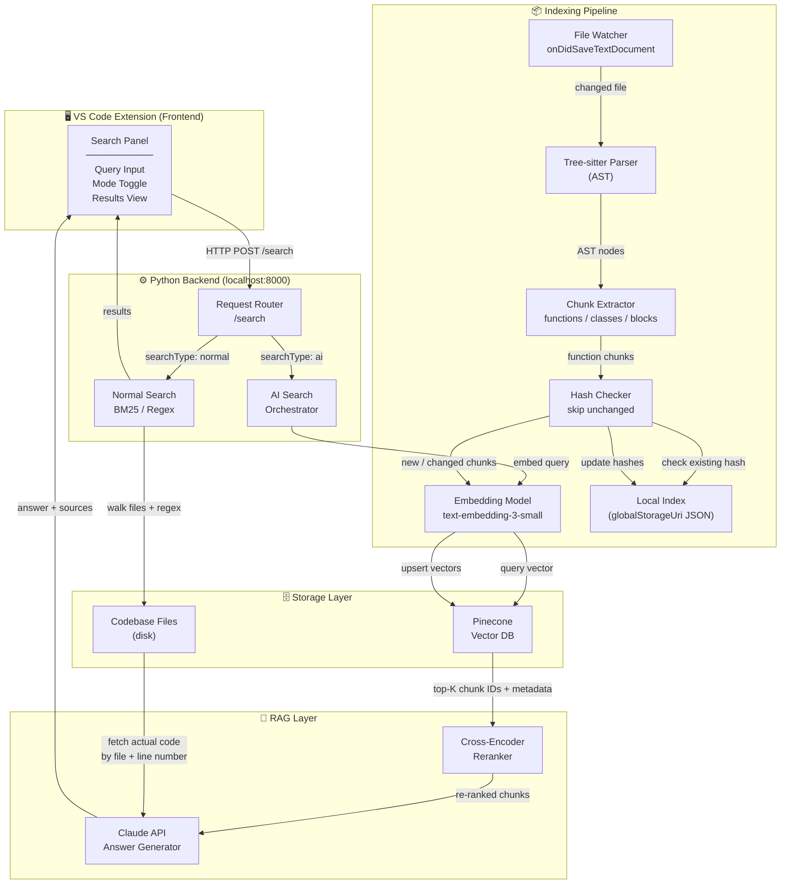
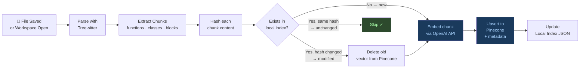
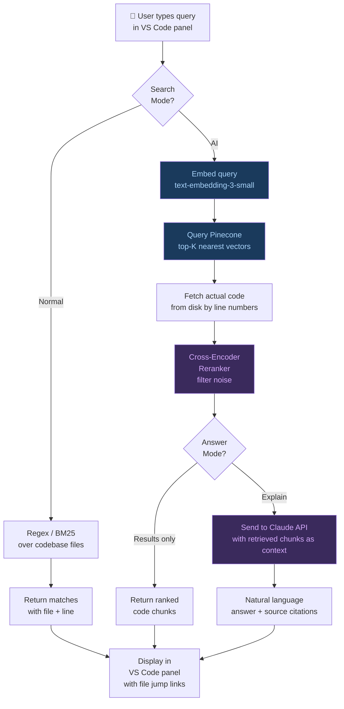
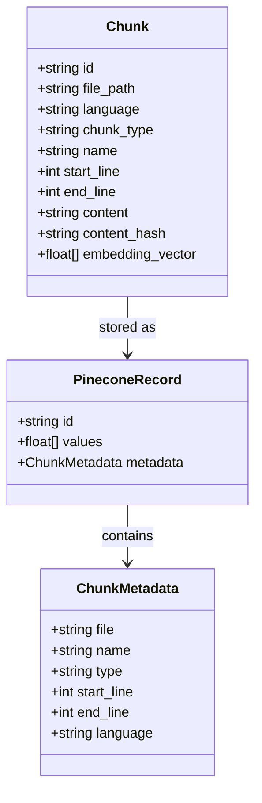
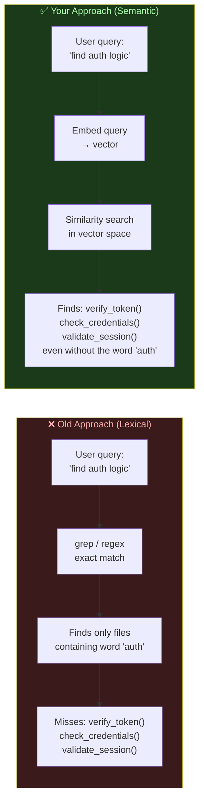

# Smart Search — System Architecture

## Full System Overview

---

## Indexing Pipeline (Detail)

---

## Search Pipeline (Detail)

---

## Chunk Metadata Structure

---

## Comparison: Old vs New Approach

