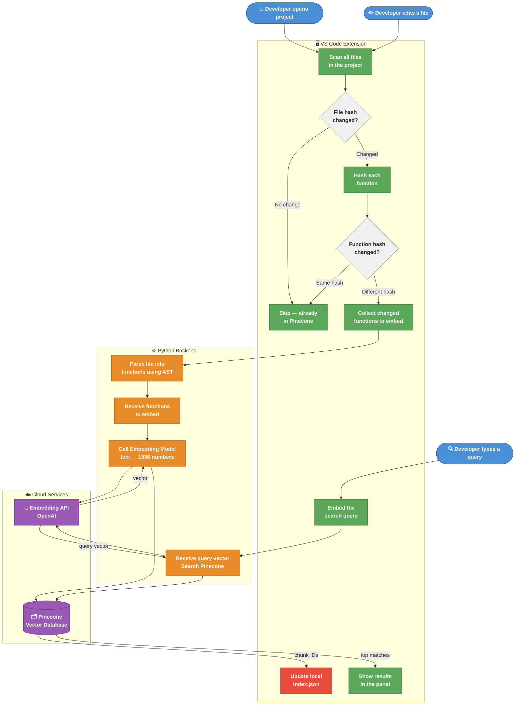
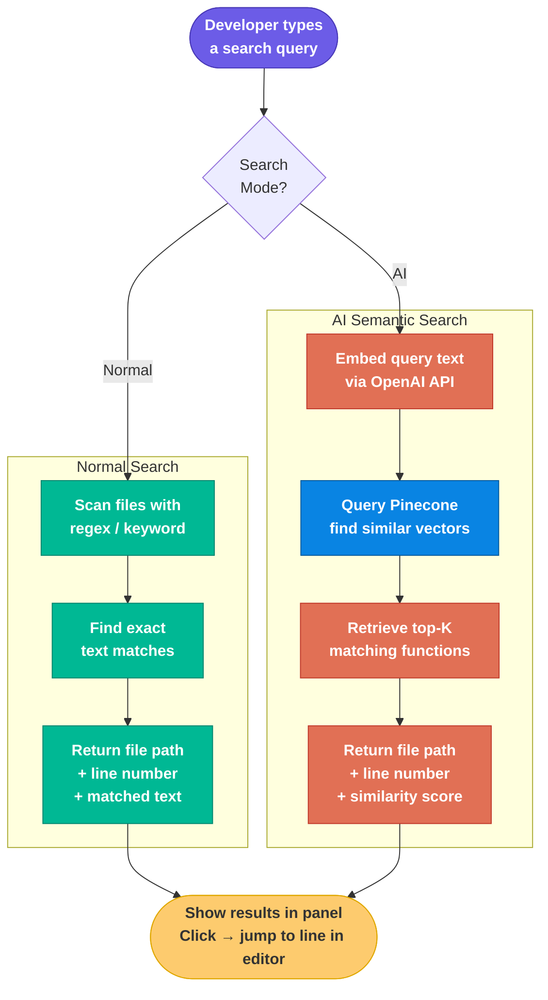
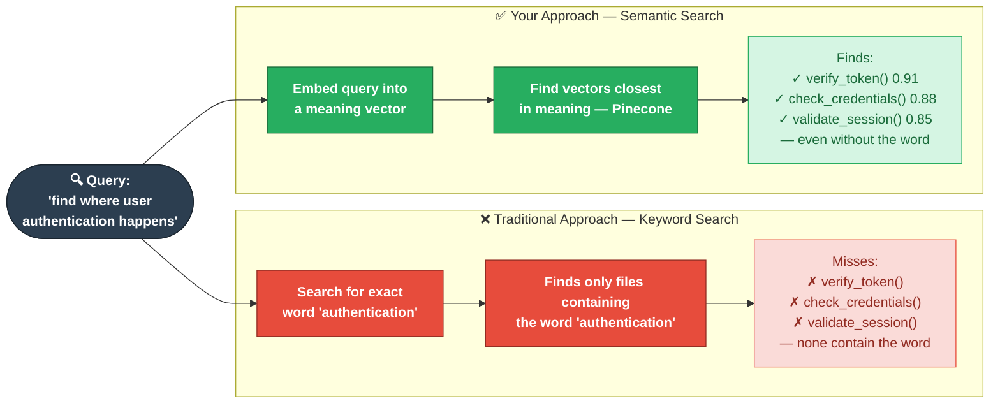

# Smart Search — System Diagrams

Paste each diagram into **mermaid.live** → click Export → Save as PNG or SVG.

---

## Diagram 1 — Full System Overview

---

## Diagram 2 — Indexing Pipeline (Detail)

```mermaid
flowchart LR
    classDef step     fill:#2E86AB,stroke:#1A5276,color:#fff,font-weight:bold
    classDef decision fill:#FFEAA7,stroke:#FDCB6E,color:#333,font-weight:bold
    classDef storage  fill:#00B894,stroke:#00856F,color:#fff,font-weight:bold
    classDef skip     fill:#B2BABB,stroke:#808B96,color:#333
    classDef embed    fill:#E17055,stroke:#C0392B,color:#fff,font-weight:bold

    A([Project Opens\nor File Saved]):::step
    B[Read file\nfrom disk]:::step
    C[Hash entire\nfile — MD5]:::step
    D{Same as\nstored hash?}:::decision
    E([Skip file\n— unchanged ✓]):::skip
    F[Ask backend\nto split into functions]:::step
    G[Hash each\nfunction individually]:::step
    H{Function hash\nchanged or new?}:::decision
    I([Keep existing\nvector in Pinecone ✓]):::skip
    J[Mark function\nfor re-embedding]:::embed
    K[Delete old vector\nfrom Pinecone]:::embed
    L[Embed new content\nvia OpenAI API]:::embed
    M[Save new vector\nto Pinecone]:::storage
    N[Update index.json\nwith new hashes]:::storage

    A --> B --> C --> D
    D -->|Yes| E
    D -->|No| F --> G --> H
    H -->|No change| I
    H -->|Changed or new| J --> K --> L --> M --> N
```

---

## Diagram 3 — Search Pipeline (Detail)

---

## Diagram 4 — Old vs New Approach (for Research Paper)

