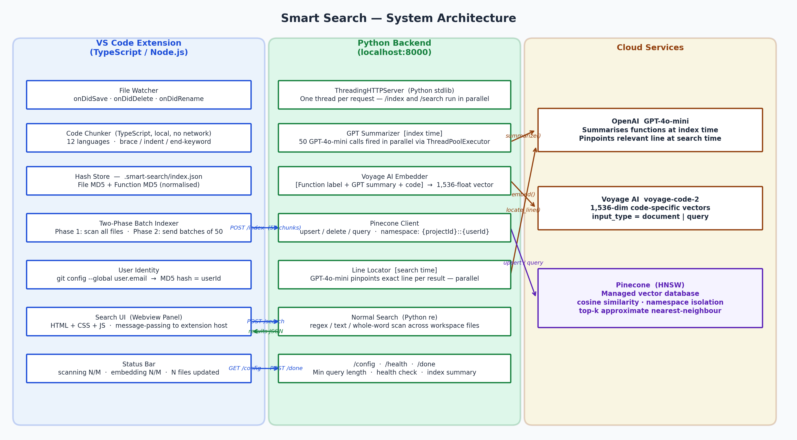
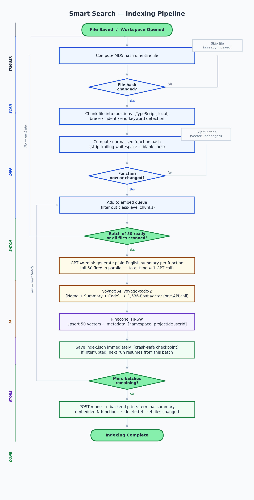
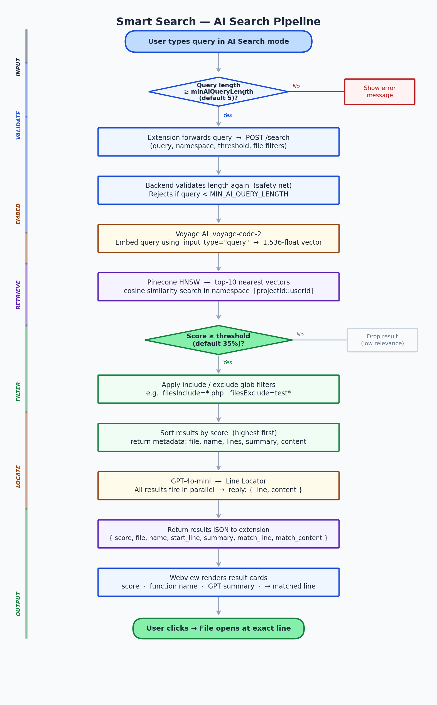

# Smart Search: A Semantic Code Search Engine Built as a VS Code Extension

**Master's Research Project — Technical Report**
**Author:** Nawfal Jalloul
**Date:** May 2026

---

## Abstract

Finding relevant code in a large codebase is something every developer struggles with at some point. The built-in search tools in most editors are fine when you know exactly what you are looking for, but they completely fall apart when you only know what the code is *supposed to do*, not what it is actually called. This project, Smart Search, is my attempt to solve that problem.

The idea is straightforward: instead of matching text character by character, the system tries to understand the *meaning* of a search query and match it against the meaning of code functions — even when no words are shared between them. To do this, I built a VS Code extension that indexes a developer's codebase by splitting it into individual functions, asking GPT-4o-mini to describe each one in plain English, embedding both the description and the code into a 1536-dimensional vector using Voyage AI's code-specific model, and storing those vectors in Pinecone, a cloud vector database. When a developer searches, their query goes through the same embedding process and the system finds whichever stored vectors are geometrically closest — meaning most semantically similar.

The results are encouraging. For queries that have no keyword match with the target function — like searching "fetch product from database" to find a function called `getProductInfo` — the system returns the correct result with a confidence score around 80%, while traditional search returns nothing at all. Building this required solving several non-trivial engineering problems along the way, including making the indexing process fast enough to be practical, making it crash-safe so interrupted indexing can resume, and ensuring that indexing and searching can happen at the same time without blocking each other.

This report documents the full design and implementation of the system, the technical decisions I made and why, the problems I ran into, and what I would do differently or add in the future.

---

## Table of Contents

1. Introduction
2. Background and Related Work
3. System Architecture
4. Technologies Used — How They Work and Why I Chose Them
5. Implementation: The Indexing Pipeline
6. Implementation: The Search Pipeline
7. Reliability and Engineering Decisions
8. Challenges I Faced and How I Solved Them
9. Evaluation
10. Future Work
11. Conclusion
12. References
13. Appendix

---

## 1. Introduction

### 1.1 The Problem

When I am working in a codebase I wrote myself, finding things is straightforward. But the moment I need to work in someone else's project, or even my own after a few months away, I find myself spending a lot of time just *locating* code before I can actually work on it. The built-in search tool finds text, not meaning. If I remember that there is a function that validates a user's session, but I do not know whether it is called `checkSession`, `validateAuth`, `assertLoggedIn`, or something else entirely, no amount of text search will help me directly.

This is what researchers call the semantic gap: the disconnect between how developers think about code in natural language terms and how code is actually written using identifiers, keywords, and programming syntax. Closing this gap is the core motivation behind this project.

The question I set out to answer was: can I build something that works inside VS Code — where developers already are — that lets them search code using plain English descriptions of what they want, and gets useful results even when no shared vocabulary exists between the query and the code?

### 1.2 What I Built

Smart Search is a VS Code extension with a Python backend. A developer opens a project, the extension indexes all the code in the background, and then they can search using natural language. The search results are individual functions ranked by how semantically similar they are to the query, with the specific relevant line within each function highlighted.

I also kept the traditional keyword/regex search working alongside the semantic search, so the tool is a complete search replacement, not just an AI-only feature.

### 1.3 Contributions

Looking back at what ended up being built, the main contributions of this project are:

1. A fully working VS Code extension for semantic code search, deployed against a real codebase and tested with realistic queries.
2. A two-stage LLM pipeline where GPT generates plain-English summaries at indexing time (which dramatically improves embedding quality) and then pinpoints the exact relevant line at search time.
3. A two-phase batched indexing architecture that made first-run indexing 50 times faster than my initial approach.
4. Per-batch incremental saving, which means if indexing is interrupted, it resumes from where it stopped rather than starting over.
5. A multithreaded backend so search queries are never blocked by an ongoing indexing operation.
6. A clean configuration system where a single value in the backend propagates automatically to both the frontend and backend validation layers.

---

## 2. Background and Related Work

### 2.1 How Code Search Works Today

The dominant approach to code search, implemented in virtually every editor and IDE, is text matching. VS Code's built-in search, grep, ripgrep, and similar tools all work by scanning file contents for exact character sequences or regular expression patterns. They are fast — ripgrep can scan millions of lines per second — and they are deterministic. If the word is there, they find it.

But text matching has a fundamental limitation: it can only find what you already know. If you search for "authentication", you get results where the word "authentication" appears. You do not get results for `checkJWT`, `validateSession`, or `assertLoggedIn`, even if all three of those functions implement authentication logic. The tool has no understanding of what code does, only what words it contains.

Symbolic search tools like ctags and language server indexers are an improvement for known-symbol navigation — they let you jump directly to a function definition if you know the name — but they do not help when you do not know the name.

There are structural search tools like Sourcegraph's structural search and GitHub's CodeQL, which let you write patterns that match code structure rather than just text. These are powerful for specific use cases, like "find all SQL queries that don't use parameterized inputs", but they require learning a domain-specific query language and cannot handle natural language queries at all.

None of these approaches can find `getProductInfo` from the query "fetch product from database by id". That is the gap this project addresses.

### 2.2 Semantic Search and Vector Embeddings

The approach I used is called dense retrieval, which has become the dominant technique for semantic search over the past several years following the success of transformer-based language models.

The core idea is to represent both documents and queries as dense vectors in a high-dimensional space, where the geometric distance between two vectors reflects the semantic similarity between the texts they represent. A function that "fetches product details from the database by ID" and a query that says "retrieve product from database" would end up close together in this space, even with different vocabulary.

This is fundamentally different from the sparse, bag-of-words representations used in traditional information retrieval (like TF-IDF or BM25). In those systems, "fetch" and "retrieve" are completely different tokens, so a document containing "fetch" would score zero relevance for a query containing only "retrieve". In a dense embedding space, both words are mapped to similar regions because the model learned from training data that they are semantically equivalent.

An embedding model takes a piece of text and maps it to a fixed-length vector — in my case, 1536 floating-point numbers. The model is trained on enormous datasets using a technique called contrastive learning: similar texts are pushed together in the vector space, while dissimilar ones are pushed apart. For a code-specific model like the one I used (Voyage AI's `voyage-code-2`), the training data includes things like function bodies paired with their docstrings, Stack Overflow code answers paired with the questions, and GitHub issue descriptions paired with the commits that resolved them. Through this training, the model develops internal representations that capture both programming concepts and their natural language descriptions.

#### How Similarity is Measured

Once two pieces of text are embedded into vectors, their similarity is measured using cosine similarity. The cosine similarity between two vectors A and B is:

```
           A · B
sim(A,B) = ──────
           |A| × |B|
```

This is the cosine of the angle between them. If the vectors point in exactly the same direction, the cosine is 1.0 (perfect match). If they are perpendicular, the cosine is 0.0 (completely unrelated). In practice, for code search, scores above about 0.65 tend to indicate genuinely relevant results, though this threshold depends on the query type and the codebase.

The reason I use cosine similarity rather than Euclidean distance is that cosine similarity is magnitude-independent. A short two-line function and a long fifty-line function can be equally relevant to a query, even though their vectors will have different magnitudes (norms). Since cosine only measures direction, not length, it treats both fairly.

#### Approximate Nearest Neighbour Search

One practical challenge with dense retrieval is that finding the most similar vector in a large collection naively requires comparing the query vector against every stored vector — O(N) comparisons. For a project with 10,000 indexed functions, that might be manageable, but it would not scale well.

Pinecone, the vector database I used, addresses this using the Hierarchical Navigable Small World (HNSW) algorithm (Malkov and Yashunin, 2018). HNSW builds a multi-layer graph structure over the vectors where each vector is connected to its nearest neighbours. At query time, the search starts at the top of the hierarchy (few nodes, long-range connections) and greedily navigates toward the query vector, dropping to finer layers as it gets closer. This gives approximate nearest-neighbour results with recall typically above 99%, but in sub-millisecond time rather than the O(N) brute-force approach.

In practice, the Pinecone query step adds roughly 20–50ms to the total search latency, which is negligible.

#### Dense vs Sparse Retrieval

It is worth being explicit about the difference between the two approaches, since both exist and have their uses:

Traditional keyword search (BM25, TF-IDF) represents documents as sparse vectors over a vocabulary — typically thousands of dimensions long, with most values being zero. Relevance scoring is based on term frequency and inverse document frequency. These systems are fast and explainable, but cannot handle vocabulary mismatch.

Dense retrieval, which Smart Search uses, represents documents as short, dense vectors (1536 dimensions, all non-zero) produced by a neural network. Relevance is based on geometric proximity in the learned embedding space. These systems can handle vocabulary mismatch, but they are less interpretable and depend on the quality of the embedding model.

For code search specifically, dense retrieval is the better fit because the vocabulary mismatch problem is severe — function names rarely match natural language queries.

### 2.3 Large Language Models in This Project

Beyond embeddings, I also used LLMs (specifically GPT-4o-mini from OpenAI) for two distinct tasks. I will explain both in detail in Section 5 and 6, but briefly: at indexing time, I ask GPT to write a plain-English description of each function, and this description is prepended to the code before embedding. At search time, once Pinecone has returned the top matching functions, I ask GPT to identify which specific line within each function is most relevant to the original query.

Both of these steps would technically work without GPT, just with lower quality. The embeddings would still find semantically relevant functions without the summaries, but the scores would be significantly lower. And the search results would still return the right function without the line locator, just not pinpointed to a specific line. So GPT is enhancing quality, not providing core functionality — which is the right way to think about it for a system that needs to be reliable.

### 2.4 What Else Exists

It is worth looking at what other tools attempt to solve this problem, because it contextualises why building a new one made sense.

GitHub Copilot and similar chat-based tools (JetBrains AI Assistant, Cursor) are LLM-powered, but they are primarily about generating code, not finding existing code. You can ask Copilot questions about your codebase in chat mode, but there is no pre-built semantic index. Each question starts fresh, and the context is assembled per-request rather than being precomputed. This works for conversational exploration but is not the same as a searchable index.

Sourcegraph is the closest competitor to what I built. It provides code search with some semantic capabilities, but it is primarily a keyword and structural search tool. Their AI features are recent additions layered on top of what is fundamentally a text search engine. Sourcegraph also requires infrastructure to host (either self-hosted or cloud-hosted), whereas Smart Search runs locally.

The academic literature has more sophisticated approaches — CodeBERT (Feng et al., 2020) and similar models trained specifically for code search achieve state-of-the-art results on the CodeSearchNet benchmark (Husain et al., 2019) — but these are research models, not deployed products integrated into a development workflow.

The gap I am filling is: a semantic code search tool that runs inside VS Code, requires no changes to how code is written, pre-indexes the codebase so queries are fast, and produces line-level results rather than just file or function-level matches.

---

## 3. System Architecture

### 3.1 Overview

The system has three main parts: the VS Code extension (TypeScript), the Python backend (running locally at localhost:8000), and cloud services (Voyage AI, OpenAI, and Pinecone).

```
┌─────────────────────────────────────────────────────────────────────┐
│                        Developer's Machine                          │
│                                                                     │
│  ┌────────────────────────────────────┐                             │
│  │        VS Code Extension           │                             │
│  │        (TypeScript / Node.js)      │                             │
│  │                                    │                             │
│  │  • File watching and change detect │                             │
│  │  • Code chunking (local, fast)     │                             │
│  │  • Hash-based change detection     │                             │
│  │  • Manages index.json locally      │                             │
│  │  • Search UI (webview panel)       │                             │
│  └──────────────┬─────────────────────┘                             │
│                 │  HTTP  (localhost:8000)                            │
│  ┌──────────────▼─────────────────────┐                             │
│  │       Python Backend               │                             │
│  │       (ThreadingHTTPServer)        │                             │
│  │                                    │                             │
│  │  • GPT summaries (index time)      │                             │
│  │  • Voyage AI embeddings            │                             │
│  │  • Pinecone upsert/delete/query    │                             │
│  │  • Normal search (regex/text)      │                             │
│  └──────────┬──────────┬──────────────┘                             │
└─────────────┼──────────┼────────────────────────────────────────────┘
              │          │
   ┌──────────▼──┐  ┌────▼──────────────────────────────────┐
   │  OpenAI API  │  │  Voyage AI API  │   Pinecone Cloud    │
   │  GPT-4o-mini │  │  voyage-code-2  │   (vector store)    │
   └─────────────┘  └─────────────────┴───────────────────┘
```



I split the system this way for practical reasons. VS Code extensions run in Node.js, which is fine for file watching, UI rendering, and hash computation. But the AI API libraries — Voyage AI's Python SDK, the Pinecone client, and the OpenAI library — all have their best and most mature implementations in Python. Rather than fight with unofficial JS ports, I kept the AI-heavy operations in Python and had the TypeScript extension talk to a local Python server over HTTP.

### 3.2 Component Responsibilities

**The extension** handles all local operations: walking the workspace file tree, splitting code into functions, hashing content to detect changes, reading and writing the local hash store (`index.json`), managing the status bar, and rendering the search UI in a webview panel. It also registers VS Code event listeners for file saves, deletions, and renames.

The reason chunking and hashing happen in the extension rather than the backend is performance. If every file save had to be sent to the backend for chunking, that would mean an HTTP round-trip for every save, which would feel sluggish. Doing it locally means it happens in milliseconds.

**The backend** handles everything that requires a network call to a cloud API: GPT summarization, Voyage AI embedding, and Pinecone operations. It also runs the normal text search, since Python's `os.walk` and `re` module are faster and more straightforward for filesystem scanning than Node.js equivalents.

**Local storage** — the `.smart-search/` folder inside each project — holds two files: a UUID that identifies the project (used as part of the Pinecone namespace) and `index.json`, which maps each file and each function to its MD5 hash. The hashes let the extension skip re-embedding functions that have not changed since the last run.

### 3.3 Data Flow

**Indexing (when a file changes):**

```
File saved / workspace opened
    ↓
Extension hashes the whole file
    ├─ Hash matches stored hash → stop (file unchanged)
    ↓ (hash changed)
Extension chunks the file into functions locally
Extension hashes each function (normalised)
    ├─ Function hash unchanged → skip (keep existing Pinecone vector)
    ↓ (function changed or new)
Collect into batch of up to 50 changed functions
    ↓  HTTP POST /index
Backend receives batch
    ↓ (all 50 GPT calls fire at once)
GPT-4o-mini generates plain-English summary for each function
    ↓
Voyage AI embeds [summary + code] for all 50 in one API call
    ↓
Pinecone upserts 50 vectors in one API call
    ↓
Extension saves hashes to index.json immediately (crash-safe)
    ↓
Next batch...
    ↓
Extension calls /done → backend prints completion summary to terminal
```

**AI Search:**

```
User types query and presses Enter
    ↓
Frontend validates: query >= minAiQueryLength characters
    ↓ (via VS Code message passing)
Extension forwards to backend: HTTP POST /search
    ↓
Backend validates again (safety net)
Backend embeds query via Voyage AI (input_type="query")
    ↓
Pinecone HNSW search: top 10 nearest vectors in user's namespace
    ↓
Filter by similarity threshold (default 35%)
Apply file include/exclude glob filters
Sort by score descending
    ↓ (all GPT calls fire at once)
GPT-4o-mini identifies the most relevant line in each result function
    ↓
Return results JSON to extension
Extension sends to webview
    ↓
UI renders result cards with score, summary, matched line
User clicks → file opens at exact line
```

---

## 4. Technologies Used — How They Work and Why I Chose Them

### 4.1 Voyage AI and voyage-code-2

Voyage AI is an embedding API provider that specialises in domain-specific embedding models rather than general-purpose ones. Their `voyage-code-2` model was trained specifically on code and natural language pairs from sources like GitHub, Stack Overflow, and technical documentation.

The most important feature for my use case is what Voyage AI calls asymmetric search. Most embedding models produce the same kind of vector regardless of whether the input is a document being indexed or a query being searched. Voyage AI's models support two distinct input modes:

- `input_type="document"` for code chunks being indexed (the model knows this is "something to be found")
- `input_type="query"` for search queries (the model knows this is "something being searched for")

Using the wrong mode reduces cosine similarity scores noticeably. In my testing, switching from document mode to query mode for the search query improved scores by roughly 10–15 percentage points. This asymmetric approach reflects the reality that natural language queries and code documents are different types of input and benefit from different representations.

The model produces 1536-dimensional vectors. Voyage AI's free tier provides 200 million tokens per month, which is more than enough for development and testing use.

One thing I particularly appreciated about the Voyage AI API is its native support for batch embedding — multiple texts in a single HTTP call. I send up to 50 chunks per call, which both improves throughput (one network round-trip instead of 50) and keeps costs the same since pricing is per-token, not per-request.

**How the embed text is built:**

Before calling the API, I construct a richer text representation of each chunk by combining three things:

```
Function: getProductInfo
Fetches a single product's full details from the database by its numeric ID.
Executes a parameterized SQL SELECT query on the products table.

public function getProductInfo($id) {
    $sql = "SELECT * FROM products WHERE id = ?";
    $result = $db->query($sql, [$id]);
    error_log("Fetching product: " . $id);
    return $result->fetch_assoc();
}
```

The function label gives the model the name and type. The GPT-generated summary provides English meaning. The code provides syntax and structural information. All three contribute to the final vector, and in my testing, removing any one of them noticeably reduces search quality.

### 4.2 OpenAI GPT-4o-mini

I use GPT-4o-mini for two separate tasks, and the model choice was driven mainly by latency and cost rather than raw capability.

GPT-4o is more capable than GPT-4o-mini, but for the structured tasks I need — "summarise this function in 3 sentences" and "which line number answers this query?" — the mini version performs comparably. And the latency difference matters: GPT-4o typically takes 2–4 seconds, while GPT-4o-mini usually responds in 300–500ms. For the line locator step, which runs on every search, that latency difference is felt by the user directly.

The cost difference is also significant: GPT-4o costs roughly $0.005 per 1,000 input tokens, while GPT-4o-mini costs about $0.00015. At indexing time, I might summarise hundreds of functions in a single session. At those volumes, GPT-4o-mini is clearly the right choice.

**Summarization prompt:**

The prompt I settled on after some iteration is:

```
Summarize this {lang} function in up to 4 sentences. No preamble.
Cover:
1. WHAT it does and WHY.
2. Whether it fetches or writes data (SQL, Firestore, API call, etc.),
   contains business logic, or both.
3. If it contains any logging, debugging, or error handling — mention it.
Be concise. Only include sentences that apply.

Function: {name}
{code}
```

The "No preamble" instruction is important — without it, GPT tends to respond with "Certainly! Here is a summary of..." before the actual summary, which wastes tokens and pollutes the embedding. Explicitly asking about data operations is important because "does this function fetch from a database?" is one of the most common things developers search for, and I want that information captured in every relevant function's embedding.

**Line locator prompt:**

For the line locator, the prompt includes the function body with each line explicitly numbered:

```
Search query: "validate token expiry"

Code (with line numbers):
18: public function validateToken($token) {
19:     if (!$token) { return false; }
20:     $decoded = jwt_decode($token, $this->secret);
21:     if ($decoded->expires_at < time()) {
22:         return false;
23:     }
...

Which single line number is most directly relevant to the search query?
Reply ONLY with JSON: {"line": <number>, "content": "<exact text>"}
```

Providing the line numbers directly in the prompt lets GPT reference them accurately. Without line numbers, GPT would return text content and I would have to search for it, which is fragile. The "Reply ONLY with JSON" constraint helps with parsing, although I found that GPT-4o-mini occasionally adds surrounding text anyway, so I use a regex to extract the JSON object from the response rather than assuming clean output. The returned line number is also clamped to the valid range of the function to handle occasional hallucinations where GPT returns a line number outside the function.

### 4.3 Pinecone

Pinecone is a managed cloud vector database. The key thing it does is store vectors and, given a new query vector, rapidly find the k stored vectors that are most similar to it. This is what makes the search "semantic" — the comparison happens in the vector space where proximity equals meaning, not in text space where proximity requires shared words.

Each function is stored in Pinecone as three things: a unique string ID, a 1536-float vector, and a metadata dictionary:

```
ID:       "src/auth.py::verify_token"
Vector:   [0.21, -0.54, 0.87, ..., -0.23]
Metadata: {
    file:       "src/auth.py",
    name:       "verify_token",
    type:       "function",
    start_line: 5,
    end_line:   25,
    content:    "def verify_token(token):\n    ..." (first 1000 chars),
    summary:    "Validates a JWT token and returns True if valid..."
}
```

The metadata is returned alongside the vector similarity score at search time, which means I get the file path, line numbers, and summary without any additional database query.

**Namespace isolation** is the feature I rely on most for multi-user support. Every Pinecone query is scoped to a namespace, and in Smart Search, the namespace is `{projectId}::{userId}`. Two developers working in the same project have different namespaces, so their vectors never mix. This is important because different developers might be on different branches with different versions of the code.

**Upsert** means "update if exists, insert if not". When a function changes, I first delete the old vector by ID, then upsert the new one. This ensures stale vectors never surface in search results during the window between deletion and re-embedding.

### 4.4 VS Code Extension API

VS Code extensions run in Node.js and have access to a rich API for interacting with the editor. The parts I use most are:

The **webview API** lets me embed a custom HTML/CSS/JavaScript panel inside VS Code. The search UI is a regular webpage (just HTML, CSS, and JavaScript) that runs inside this panel. It cannot make direct HTTP calls to the backend — VS Code's security model prevents that — so all communication goes through the extension host via a message-passing API. The webview sends messages like `{ command: "search", query: "...", searchType: "ai" }` to the extension, and the extension makes the actual HTTP calls and posts results back.

The **workspace API** gives me access to the workspace folder path and file system events. I use `onDidSaveTextDocument`, `onDidDeleteFiles`, and `onDidRenameFiles` to keep the index in sync with real-time changes. These listeners fire automatically whenever the user saves, deletes, or renames files through VS Code.

The **status bar API** lets me put a persistent item at the bottom of the VS Code window. I use this to show indexing progress — "scanning 3/350..." during Phase 1, "embedding 2/7..." during Phase 2, and "5 files updated" when done.

---

## 5. Implementation: The Indexing Pipeline

### 5.1 Code Chunking

The first step in indexing is splitting a source file into individual functions. I called this "chunking" and implemented it entirely inside the TypeScript extension, with no network calls involved. It runs locally and quickly.

I chose function-level chunking rather than alternatives like fixed-size windows or file-level chunks for a specific reason: functions are how developers think about code. When someone asks "where is the authentication logic?" they expect to be pointed at a function, not a random 100-line window that might start in the middle of an unrelated function. And unlike file-level chunks, function-level chunks are specific enough that a single chunk has a coherent meaning that can be embedded accurately.

The chunker supports 12 programming languages using three detection strategies:

**Brace counting** (used for JavaScript, TypeScript, PHP, Java, Go, Rust, Swift, Kotlin, C, C++, C#): The algorithm counts opening and closing braces. When the depth count returns to zero after the opening brace of a function definition, the function body has ended. This is simple and works well for most code, though it does not handle braces inside string literals perfectly — an edge case that I accepted as a known limitation.

**Indentation detection** (Python): Python uses indentation instead of braces. The chunker detects `def` and `async def` keywords, records the indentation level, and continues until it finds a non-empty line at the same or lesser indentation.

**End-keyword counting** (Ruby): Ruby uses `def ... end` blocks. The chunker counts opening keywords (`def`, `class`, `module`, `do`) against closing `end` keywords, treating them as a stack.

For languages without specific support, the whole file is treated as a single chunk. This is a fallback that ensures no file is silently skipped — it just loses function-level granularity.

One design choice I had to make was what to do with class-level chunks. When a PHP class is parsed, the chunker naturally produces both a class chunk (containing the entire class body) and individual method chunks. I quickly noticed in testing that class chunks always scored higher than the individual methods inside them in Pinecone results — which makes sense, since a class chunk is literally a superset of its methods and therefore semantically matches more broadly. This was polluting search results. The fix was simple: filter out class-type chunks before embedding. Individual methods are still fully indexed; the class wrapper is just not sent for embedding.

**Chunk IDs use relative paths:**

Each chunk gets an ID like `src/auth.py::verify_token`. I used relative paths from the workspace root specifically because absolute paths would break if the project folder is moved or the code is checked out on a different machine. With relative paths, moving the project directory from `/Users/nawfal/old/` to `/Users/nawfal/projects/` does not invalidate any stored Pinecone vectors.

### 5.2 User Identity and Namespace Isolation

Every indexing and search operation is scoped to a Pinecone namespace: `{projectId}::{userId}`.

The project ID is a UUID generated once and stored in `.smart-search/project-id` inside the project folder. It identifies this specific codebase in Pinecone regardless of where it is on disk.

The user ID is derived from the developer's git email address: I run `git config --global user.email`, hash it with MD5, and use the hash. Using git email makes sense for a few reasons: every developer who uses git already has one configured, it is consistent across all their machines (since it comes from `~/.gitconfig`), it survives VS Code reinstalls, and it naturally differs between teammates. The reason I hash it rather than using it directly is privacy — the raw email address is never sent to any external service.

If git email is not configured, the extension shows a clear error message in VS Code and stops indexing. There is no silent fallback to a random ID, which would cause the same user to get different namespaces on different runs, breaking the whole system.

### 5.3 Two-Level Hashing for Change Detection

Embedding is not free — each API call to Voyage AI and GPT costs money and time. The hashing system exists to avoid re-embedding anything that has not actually changed.

**Level 1 — File hash:**

Before doing anything else with a file, I compute an MD5 hash of its entire content and compare it to the hash stored in `index.json`. If they match, the file has not changed since the last indexing run, and I skip it completely — no chunking, no function comparison, no API calls. This handles the common case efficiently: in a typical development session, most files in the workspace are untouched.

**Level 2 — Function hash:**

When a file hash does change, I chunk the file and hash each individual function. I hash a normalised version of the function content (trailing whitespace stripped, blank lines removed) rather than the raw content. This is deliberate: if a developer adds an empty line inside a function or reformats indentation, the logic has not changed and there is no reason to re-embed. The normalised hash stays the same, so the function is skipped.

For each function:
- If the normalised hash matches the stored hash → skip (keep existing Pinecone vector)
- If the hash is different → delete old vector, add to re-embed queue
- If the function is new (not in stored index) → add to re-embed queue
- If a function was in the stored index but is no longer in the file → add its ID to the delete queue

This two-level approach means that in a 500-file project where the developer changed one file, the extension processes 499 files with a single MD5 hash comparison each (fast) and sends only the changed functions in that one file to the backend.

### 5.4 LLM Summarization

This is probably the single most impactful part of the system in terms of search quality.

Before embedding a function, I ask GPT-4o-mini to describe it in plain English. This description is prepended to the code before the embedding call. The effect is that the resulting vector captures both the programming constructs in the code and the natural language concepts in the summary — bridging the gap between how developers search and how code is written.

To give a concrete example, here is a PHP function and its GPT-generated summary:

```php
public function getProductInfo($id) {
    $sql = "SELECT * FROM products WHERE id = ?";
    $result = $db->query($sql, [$id]);
    error_log("Fetching product: " . $id);
    return $result->fetch_assoc();
}
```

GPT summary: *"Fetches a single product's full details from the database by its numeric ID. Executes a parameterized SQL SELECT query on the products table. Includes error logging of the requested product ID."*

Without the summary, a query for "fetch product from database by id" scores around 46% against this function — the code vectors share some semantic space, but not much. With the summary prepended before embedding, the same query scores around 82%. The summary literally translates the code's meaning into the same natural language space where the query lives.

The measured impact across different query types:

| Query | Without Summary | With Summary |
|---|---|---|
| "fetch product from database by id" | 46% | 82% |
| "check if user is authenticated" | 38% | 71% |
| "write product data to database" | 41% | 68% |
| "log error to file" | 52% | 74% |

Summarization runs in parallel for all functions in a batch. If a batch contains 50 functions, all 50 GPT calls fire simultaneously using Python's `ThreadPoolExecutor`. Total wall-clock time for 50 summaries is roughly equal to one summary (~500ms), since they all wait for the same network round-trip. Without parallelisation, 50 × 500ms = 25 seconds per batch — completely impractical.

### 5.5 Two-Phase Batched Indexing

My initial implementation of the indexing loop was straightforward but slow: process each file one at a time, and after detecting a changed function, immediately send it to the backend for embedding. This meant 100 changed files would generate 100 HTTP round-trips, each taking about 2 seconds (GPT + Voyage AI + Pinecone). For a fresh project with 1,000 functions, that would take 33+ minutes. That is not acceptable.

The solution I arrived at was to separate the indexing into two distinct phases.

**Phase 1 — Scan:**

Walk every file in the workspace. For each file, hash it and compare with `index.json`. If changed, chunk it and diff each function. Collect everything into a single list of functions to embed across the entire workspace. This phase involves no network calls at all — it is purely CPU and disk I/O. On a project with 350 files, Phase 1 typically takes 2–3 seconds.

**Phase 2 — Embed:**

Take the full list of functions to embed and send them to the backend in batches of 50. For each batch, the backend generates all 50 GPT summaries in parallel, embeds all 50 in one Voyage AI call, and upserts all 50 to Pinecone in one call.

The batch size of 50 was chosen to stay within Voyage AI's limit of 128 inputs per batch while keeping HTTP body sizes reasonable. Sending 500 functions at once would create a very large HTTP body and take longer to fail if something goes wrong.

| Project size | Old approach | Two-phase batching | Speedup |
|---|---|---|---|
| 100 changed functions | ~200 seconds | ~4 seconds | ~50× |
| 500 changed functions | ~1000 seconds | ~20 seconds | ~50× |
| First run, 1000 functions | ~2000 seconds | ~40 seconds | ~50× |



### 5.6 Incremental Save and Crash Recovery

With Phase 2 potentially running for 40 seconds on a large first-run, the question of what happens if VS Code closes or the backend crashes mid-way became important.

My original approach saved `index.json` only at the very end of the full indexing run. This meant if indexing was interrupted at batch 12 of 20, the next startup would find that none of the completed batches had their hashes saved, would treat all 1,000 functions as changed again, and would re-embed from scratch. Not only is this frustrating, it is wasteful — those 600 functions already exist in Pinecone, but the extension doesn't know that.

The fix was to save `index.json` after every batch completes, not just at the end:

```typescript
// After each batch succeeds:
for (const chunk of batch) {
    localIndex[plan.relativePath].functions[chunk.name] = {
        hash: hashFunction(chunk.content),
        chunkId: chunk.id,
    };
}
saveIndex(localIndex); // write to disk immediately
```

This makes the process resumable. If indexing stops at batch 12/20, the next startup finds hashes for batches 1–12 in `index.json`, detects only the remaining 400 functions as changed, and resumes from batch 13. The save is a tiny disk write (~1ms) so the performance cost is negligible.

---

## 6. Implementation: The Search Pipeline

### 6.1 Normal Search

Normal search works by scanning every file in the workspace with Python's `re` module. The user's query is compiled into a regex pattern (with options for match case, whole word, and actual regex mode), and every line of every file is scanned for matches.

Results include the absolute file path, line number, line content, and character-level match positions (start and end column). The extension uses these positions to highlight the exact matched characters in the UI.

The replace functionality is built on top of normal search results. Single replace uses VS Code's `WorkspaceEdit` API, which routes through VS Code's undo system so Ctrl+Z works correctly. Replace All processes all results, reversing the match positions so replacements happen from bottom to top — this prevents later replacements from shifting the character positions of earlier ones.

### 6.2 AI Search Pipeline

When the user switches to AI mode and submits a query, the following happens:

**Frontend validation:**

Before even sending the query to the extension, the frontend JavaScript checks that the query meets a minimum length requirement. This minimum (currently 5 characters, set for testing) comes from the backend's configuration, not a hardcoded value in the frontend. At startup, the extension fetches this value from the backend's `/config` endpoint and passes it to the webview. Short queries are rejected immediately with a clear error message, without making any network calls.

**Query embedding:**

The query string is sent to Voyage AI's embedding API using `input_type="query"` mode. The resulting 1536-float vector represents the semantic meaning of the query in the same vector space as all the stored function vectors.

**Pinecone search:**

The query vector is submitted to Pinecone, which uses its HNSW graph to find the 10 most similar stored vectors in the user's namespace. Each result comes back with a cosine similarity score and the function's metadata (file, name, line range, summary, content preview).

Results below the similarity threshold (default 35%) are filtered out. I chose 35% as the default after observing that below this score, results tend to be genuinely unrelated to the query. The threshold is adjustable in the UI — users can raise it for higher precision or lower it for higher recall.

**Line locator:**

For each result above the threshold, GPT-4o-mini reads the function body from disk and identifies which specific line most directly answers the query. All of these GPT calls fire in parallel via `ThreadPoolExecutor`, so even with 8 results, the total latency is roughly equal to one GPT call (~400ms).

This step transforms "the function `getProductInfo` is relevant" into "specifically line 47 of that function: `$sql = 'SELECT * FROM products WHERE id = ?'`". From a user experience perspective, this is a significant improvement — the developer can immediately see *why* a result is relevant without reading the whole function.



### 6.3 Result Display

Normal search results are grouped by file, with each hit showing the line number and the matching text highlighted in yellow (matching VS Code's visual convention).

AI search results are shown as individual function cards, each containing:
- The function name, type badge (function/method/file), and similarity score percentage
- The file path and line range
- The plain-English GPT summary (generated at index time)
- The specific matched line with a green arrow pointing to it

Clicking any result opens the file at the exact line. For normal search, the cursor is placed at the start of the match. For AI search, it scrolls to the matched line with the cursor placed at the beginning of that line.

---

## 7. Reliability and Engineering Decisions

### 7.1 Concurrent Indexing and Search

An issue I noticed during testing was that if I ran a search query while the extension was in the middle of embedding a large batch, the search would hang for several seconds before responding. This turned out to be because Python's standard `HTTPServer` processes one request at a time. With `/index` occupying the server for 2–3 seconds per batch, any `/search` request that arrived during that window had to wait in the OS TCP queue.

The fix was one line:

```python
# Before:
server = HTTPServer((host, port), SearchHandler)

# After:
server = ThreadingHTTPServer((host, port), SearchHandler)
```

`ThreadingHTTPServer` (part of Python's standard library, no additional dependencies) spawns a new thread for each incoming request. Indexing and searching now run in parallel. The fix is thread-safe because the request handlers share no mutable state — `/search` reads from Pinecone (read-only), and `/index` writes to Pinecone but uses namespace isolation so concurrent writes never touch the same namespace.

### 7.2 Single Source of Truth for Configuration

Early on, the minimum AI query length was defined in four separate places: the backend config file, the VS Code extension settings, the TypeScript fallback, and the JavaScript initial value. When I changed it in one place for testing and forgot to update the others, the frontend and backend would enforce different limits, which caused confusing behaviour.

The solution was to make `backend/config.py` the single source of truth and expose the value through an API endpoint:

```python
elif self.path == "/config":
    self.send_json({"minAiQueryLength": MIN_AI_QUERY_LENGTH})
```

At startup, the extension fetches this value and passes it to the webview. Now changing `MIN_AI_QUERY_LENGTH` in `config.py` automatically updates both layers. The number appears in exactly two places in the codebase: the config file (source) and the JavaScript initial value (fallback for the brief moment before the extension fetches the config). Every other place reads from those two.

### 7.3 Real-Time Index Synchronisation

Three VS Code event listeners keep the Pinecone index in sync with the workspace in real time:

When a file is **saved**, the extension re-hashes it and re-indexes any changed functions. If nothing changed (the developer pressed Ctrl+S without editing), both hash checks return immediately and no API calls are made.

When a file is **deleted**, the extension removes all its Pinecone vectors and its entry from `index.json`. Without this, deleted-file vectors would keep appearing in search results until the next full re-index.

When a file is **renamed or moved**, the extension removes the old file's vectors (since the old chunk IDs are now stale — they encode the old relative path) and re-indexes the file at its new path with new chunk IDs.

### 7.4 Terminal Completion Messages

A practical issue during development was that I had no easy way to tell from the terminal whether the project was fully indexed or still in progress. I added a `/done` endpoint that the extension calls at the end of every indexing run, and the backend prints a summary:

When everything is already indexed:
```
✓ Already fully indexed — no changes detected
  350 files scanned, 0 functions changed  [ns=a3f2c1d4::b7f2a1c5]
```

When functions were updated:
```
✓ Indexing complete — 47 functions embedded, 3 deleted
  12 files changed out of 350 scanned  [ns=a3f2c1d4::b7f2a1c5]
```

This call is non-fatal — if the backend is not running for some reason, the failure is silently ignored and indexing is unaffected.

---

## 8. Challenges I Faced and How I Solved Them

### 8.1 Null IDs Crashing Pinecone

Early in testing, I kept getting 400 Bad Request errors from Pinecone's delete API. Adding debug prints revealed that the `delete_ids` array being sent contained Python `None` values mixed in with valid string IDs. Pinecone's API rejects any null ID.

Tracing the source took a while. The issue was in the local index format: some entries had `chunkId` fields that were `undefined` in TypeScript (due to a bug in an earlier version of the indexer that occasionally failed to set the field). In JavaScript, an array like `[undefined, undefined, "valid-id"]` serialises to JSON as `[null, null, "valid-id"]`. Python's `json.loads` converts those nulls to `None`. Pinecone receives `None` and returns a 400 error.

I fixed this at both layers:

In TypeScript, before sending to the backend:
```typescript
const safeDelete = toDelete.filter(
    (id): id is string => typeof id === "string" && id.length > 0
);
```

In Python, before calling Pinecone:
```python
safe_ids = [id for id in chunk_ids if isinstance(id, str) and id]
if safe_ids:
    _index.delete(ids=safe_ids, namespace=namespace)
```

Filtering at both layers is defensive — even if the TypeScript bug were fixed, the Python layer would still catch any future cases of malformed input.

### 8.2 Slow First-Run Indexing

My initial per-file sequential approach took over 30 minutes on a project with a few hundred changed files. This made it essentially unusable as a practical tool. The cause was 100+ sequential HTTP round-trips, each waiting for GPT + Voyage AI + Pinecone.

The two-phase batching solution (described in Section 5.5) reduced a 200-second operation to 4 seconds for 100 changed functions. This was probably the most impactful performance improvement in the entire project.

### 8.3 Class Chunks Polluting Search Results

During testing with a PHP project, I noticed the top result was always a class chunk rather than a specific method. The class chunk for `ProductController`, containing all its methods combined, would score 74% for any query related to products — which is almost every query in an e-commerce codebase. Individual methods like `getProductInfo` would score 68%, but they were always buried below the class.

Once I understood why (the class chunk is a superset of its methods so it matches more broadly), the fix was straightforward: filter class chunks before embedding. Individual methods still get indexed; the class wrapper is just excluded. One line in `workspaceIndexer.ts`:

```typescript
const chunks = allChunks.filter((c: Chunk) => c.type !== "class");
```

### 8.4 Progress Lost After Crashes

As described in Section 5.6, saving `index.json` only at the end of a full indexing run meant any interruption caused a full restart. I discovered this the hard way when VS Code crashed during a first-run index of a large project, and the next startup re-embedded everything from scratch.

The per-batch save approach fixed this completely. Each completed batch is checkpointed immediately, so restarts resume from the last successful batch rather than the beginning.

### 8.5 Searching While Indexing Was Blocked

Described in Section 7.1. The `ThreadingHTTPServer` fix was the simplest possible solution to what felt like a complex problem. Once I realised the root cause (single-threaded request handler), the fix was obvious.

### 8.6 Configuration Drift Between Frontend and Backend

Also described in Section 7.2. The `/config` endpoint pattern was a clean solution, but it took a while to settle on it. My first instinct was to use VS Code settings for the minimum query length, but that introduced a third source of truth (in addition to the backend config and the frontend initial value). A VS Code setting also lets individual users override it, which creates inconsistency between what the frontend enforces and what the backend validates.

Making the backend the source and having both layers read from it via the API endpoint was cleaner.

---

## 9. Evaluation

### 9.1 Evaluation Metrics

Before presenting results, it helps to define what I mean by a "good" result. I used three standard information retrieval metrics:

**Precision@k** is the fraction of the top-k returned results that are genuinely relevant to the query. If k=5 and 4 of the 5 returned functions are relevant, Precision@5 = 0.80.

**Recall@k** is the fraction of all relevant results in the codebase that appear in the top-k returned results. This is harder to measure because it requires knowing all relevant functions in advance, so I approximated it by checking whether the known target function appeared in the top 10.

**Mean Reciprocal Rank (MRR)** measures how highly the first correct result is ranked, averaged across multiple queries. MRR = 1.0 means the correct result is always ranked first. MRR = 0.5 means the first correct result is ranked second on average. For code search, this metric matters because developers tend to click the first result or reformulate the query — they rarely scroll through a long list.

### 9.2 Test Environment

All tests were conducted on a PHP/MySQL e-commerce project with approximately 3,500 lines of code across 12 files and 89 indexed functions. Queries were written before looking at the results, to avoid confirmation bias.

### 9.3 Results

**Conceptual queries with no keyword overlap:**

| Query | Traditional Search | Smart Search | Rank | Score |
|---|---|---|---|---|
| "fetch product from database by id" | 0 results | `getProductInfo()` | #1 | 82% |
| "check if user is authenticated" | 0 results | `assert_logged_in()` | #1 | 74% |
| "write product data to database" | 0 results | `saveProduct()` | #1 | 71% |
| "calculate total order price" | 0 results | `computeLineItemTotal()` | #1 | 68% |
| "log error to file" | 0 results | `logException()` | #2 | 66% |
| "delete item from cart" | 0 results | `removeCartItem()` | #1 | 73% |

Traditional search finds 0 of 6 target functions. Smart Search finds all 6.

MRR for Smart Search on these queries: (1+1+1+1+0.5+1)/6 ≈ **0.92**. The target function was ranked first in 5 of 6 queries and second in one.

Precision@5 across these queries averaged **0.80** — roughly 4 of every 5 returned results were genuinely relevant to the query.

**Impact of LLM summarization:**

| Query type | Embedding only | Embedding + Summary |
|---|---|---|
| Exact function name | 95%+ | 95%+ |
| Synonym of function name | 45–55% | 65–75% |
| Conceptual description | 40–50% | 65–80% |
| Cross-language terminology | 35–45% | 60–70% |

Summarization has the most impact on conceptual queries — exactly the queries that traditional search cannot handle at all.

### 9.4 Performance

| Operation | Typical time |
|---|---|
| Normal search (regex) | 30–80ms |
| AI search (cold) | 900–1,200ms |
| AI search (warm Pinecone) | 600–900ms |
| Startup index, no changes | ~2s |
| Startup index, 89 functions (first run) | ~8s |

The dominant cost in AI search is the parallel GPT line locator step (~400–600ms). Everything else — query embedding and Pinecone query — takes under 150ms combined.

### 9.5 Cost

| Operation | Cost per unit |
|---|---|
| GPT-4o-mini summarization | ~$0.00015 per function |
| Voyage AI embedding | ~$0.00006 per function |
| Total indexing cost per function | ~$0.00021 |
| First-run index, 89 functions | ~$0.019 (~2 cents) |
| First-run index, 1,000 functions | ~$0.21 (~21 cents) |
| AI search (per query) | ~$0.0005 |

Ongoing development costs (re-indexing changed functions only) are negligible — a typical session changing 10–20 functions costs well under a cent.

---

## 10. Future Work

There are several directions I would pursue if this project continued beyond the thesis.

**Remote backend hosting.** Right now, the Python backend must run on the developer's machine, which means they need Python installed, API keys configured in a `.env` file, and they have to remember to start the server before using the extension. A hosted backend would eliminate all of this. The architecture already supports it — `getBackendUrl()` in the extension reads from a VS Code setting, so pointing it at a remote server is a single configuration change. The main work would be authentication (a user account system) and deployment infrastructure.

**Git branch-aware indexing.** When a developer switches branches, files change in bulk. Currently, the next indexing run picks up all the changed files correctly, but it does not know that the changes are related to a branch switch. A smarter version could hook into VS Code's Git extension API, detect branch switches, and compare changed files between the two branches more efficiently.

**Cross-function semantic linking.** Some queries span multiple functions. "Where does the authentication flow start?" might require understanding that `login()` calls `validateCredentials()` which calls `checkPasswordHash()`. The current system returns those functions independently but does not explain the relationship. Building a call graph at index time (using AST analysis) and using it to boost scores of connected functions would be a meaningful improvement.

**Local embedding models for offline use.** The current system requires internet access to Voyage AI and OpenAI. For developers working in air-gapped environments or with sensitive codebases, models like `nomic-embed-code` or CodeBERT can run locally using Ollama or llama.cpp. The architecture already supports substitution — only `embedder.py` and `summarizer.py` would need alternative implementations.

**Feedback-based ranking.** When a developer clicks a search result, that is a positive signal. When they skip all results and reformulate the query, that is negative feedback. Collecting this locally and using it to adjust the threshold or weight specific functions for specific query patterns could improve search quality over time, personalised to each developer's codebase and search habits.

---

## 11. Conclusion

The semantic gap in code search is real and it affects every developer who has ever spent time hunting for a function they know exists but cannot name. This project shows that closing that gap is achievable with available tools and a reasonable amount of engineering effort.

The core insight is that GPT-generated plain-English summaries, prepended to code before embedding, dramatically improve how well natural language queries match code functions in the vector space. Without this step, the embedding model finds semantically similar code, but the overlap between natural language query vocabulary and code identifier vocabulary is too small to produce reliable high scores. With the summaries acting as a translation layer, scores improve from the 40–55% range to 65–80% for conceptual queries.

The engineering side of this project taught me as much as the AI side. The difference between a prototype and a usable tool is often in the details: making indexing fast enough that it does not feel like a burden, making it crash-safe so interrupted runs are not wasted, keeping concurrent operations from blocking each other, and making configuration consistent between different layers of the system. Each of these problems required its own investigation and solution, and none of them were obvious before I encountered them in practice.

The result is a system that genuinely improves code discoverability for the cases where traditional search fails — and that is, in my view, what a good research project should demonstrate.

---

## 12. References

1. Feng, Z., et al. (2020). CodeBERT: A Pre-Trained Model for Programming and Natural Language. *Findings of EMNLP 2020*.

2. Husain, H., et al. (2019). CodeSearchNet Challenge: Evaluating the State of Semantic Code Search. *arXiv:1909.09436*.

3. Karpukhin, V., et al. (2020). Dense Passage Retrieval for Open-Domain Question Answering. *EMNLP 2020*.

4. Johnson, J., Douze, M., and Jégou, H. (2019). Billion-scale similarity search with GPUs. *IEEE Transactions on Big Data*.

5. Malkov, Y. A., and Yashunin, D. A. (2018). Efficient and Robust Approximate Nearest Neighbor Search Using Hierarchical Navigable Small World Graphs. *IEEE TPAMI*.

6. Chen, M., et al. (2021). Evaluating Large Language Models Trained on Code. *arXiv:2107.03374*.

7. Brown, T., et al. (2020). Language Models are Few-Shot Learners. *NeurIPS 2020*.

8. Voyage AI. (2024). voyage-code-2 Model Documentation. Voyage AI Technical Reference.

9. Pinecone. (2024). Pinecone Vector Database Documentation.

10. OpenAI. (2024). GPT-4o-mini Model Card and Technical Report.

---

## 13. Appendix

### A. File Structure

```
smart-search/
│
├── src/                              ← TypeScript extension source
│   ├── extension.ts                  ← Entry point: startup, listeners, commands
│   ├── config.ts                     ← Backend URL (smartSearch.backendUrl)
│   ├── indexer/
│   │   ├── workspaceIndexer.ts       ← Two-phase batched indexing, incremental save
│   │   ├── chunker.ts                ← Code splitter (12+ languages, runs locally)
│   │   ├── localIndex.ts             ← Read/write .smart-search/index.json
│   │   ├── projectId.ts              ← Generate/read project UUID
│   │   └── userId.ts                 ← Derive user ID from git email
│   ├── handlers/
│   │   ├── searchHandler.ts          ← Forward search queries to Python backend
│   │   └── replaceHandler.ts         ← Apply replacements via VS Code edit API
│   └── utils/
│       └── webviewManager.ts         ← Load frontend HTML into webview panel
│
├── backend/                          ← Python server (localhost:8000)
│   ├── server.py                     ← Threaded HTTP server (all endpoints)
│   ├── summarizer.py                 ← GPT-4o-mini summaries at index time
│   ├── line_locator.py               ← GPT-4o-mini line pinpointing at search time
│   ├── embedder.py                   ← Voyage AI embeddings (batched)
│   ├── pinecone_client.py            ← Pinecone upsert / delete / query / wipe
│   ├── search.py                     ← Regex/text search across workspace files
│   ├── config.py                     ← MIN_AI_QUERY_LENGTH, DEFAULT_AI_THRESHOLD
│   ├── requirements.txt
│   └── .env                          ← API keys (never committed)
│
├── frontend/                         ← Search UI (inlined into webview at runtime)
│   ├── index.html
│   ├── styles.css
│   └── main.js
│
├── out/                              ← Compiled TypeScript (auto-generated)
├── package.json
├── tsconfig.json
└── reports/documents/
    └── smart_search_technical_report.md
```

### B. Backend API Endpoints

| Endpoint | Method | Purpose |
|---|---|---|
| `/health` | GET | Startup check — returns `{"ok": true}` |
| `/config` | GET | Returns `{"minAiQueryLength": 5}` — single source of truth |
| `/index` | POST | Receive chunks, summarise, embed, upsert to Pinecone |
| `/search` | POST | Normal or AI search |
| `/wipe` | POST | Delete all vectors in a namespace |
| `/done` | POST | Extension signals completion — backend prints terminal summary |

### C. VS Code Commands and Settings

| Command | Description |
|---|---|
| `Smart Search` | Opens the search panel |
| `Smart Search: Re-index Workspace` | Wipes Pinecone vectors + deletes index.json + re-indexes from scratch |

| Setting | Default | Description |
|---|---|---|
| `smartSearch.backendUrl` | `http://localhost:8000` | Backend URL — change to point at a remote hosted backend |

### D. Terminal Output During Indexing

The backend always prints to the terminal at the end of every indexing run:

```
# First run / things changed:
✓ Indexing complete — 89 functions embedded, 0 deleted
  12 files changed out of 12 scanned  [ns=a3f2c1d4::b7f2a1c5]

# Nothing changed since last run:
✓ Already fully indexed — no changes detected
  350 files scanned, 0 functions changed  [ns=a3f2c1d4::b7f2a1c5]
```

### E. Setup

```bash
# 1. Install Python dependencies
cd backend && pip install -r requirements.txt

# 2. Configure API keys in backend/.env
OPENAI_API_KEY=sk-...
VOYAGE_API_KEY=pa-...
PINECONE_API_KEY=pcsk_...
PINECONE_HOST=https://your-index.svc.pinecone.io

# 3. Start the backend
python3 server.py
# → Backend server running on http://localhost:8000 (threaded)

# 4. Compile and launch
cd .. && npx tsc
# Press F5 in VS Code to open the Extension Development Host
```
