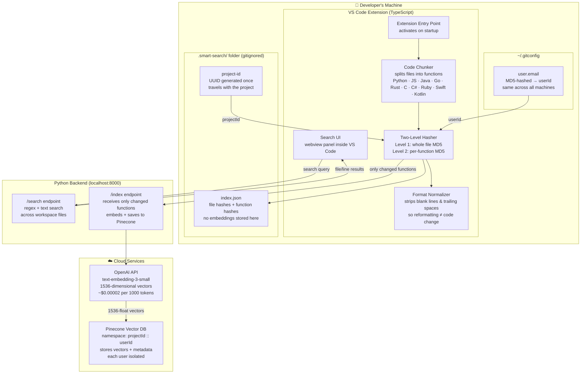

# Diagram 1 — System Architecture Overview

## How to run
Paste the code block below at: https://mermaid.live
Click "Render" — export as PNG or SVG for free.

```mermaid
graph TB
    subgraph USER["👤 Developer's Machine"]
        subgraph VSCODE["VS Code Extension (TypeScript)"]
            EXT["Extension Entry Point<br/>activates on startup"]
            CHUNKER["Code Chunker<br/>splits files into functions<br/>Python · JS · Java · Go · Rust · C · C# · Ruby · Swift · Kotlin"]
            HASHER["Two-Level Hasher<br/>Level 1: whole file MD5<br/>Level 2: per-function MD5"]
            NORM["Format Normalizer<br/>strips blank lines & trailing spaces<br/>so reformatting ≠ code change"]
            UI["Search UI<br/>webview panel inside VS Code"]
        end

        subgraph LOCAL[".smart-search/ folder (gitignored)"]
            PID["project-id<br/>UUID generated once<br/>travels with the project"]
            IDX["index.json<br/>file hashes + function hashes<br/>no embeddings stored here"]
        end

        subgraph GIT["~/.gitconfig"]
            EMAIL["user.email<br/>MD5-hashed → userId<br/>same across all machines"]
        end
    end

    subgraph BACKEND["Python Backend (localhost:8000)"]
        SEARCH_EP["/search endpoint<br/>regex + text search<br/>across workspace files"]
        INDEX_EP["/index endpoint<br/>receives only changed functions<br/>embeds + saves to Pinecone"]
    end

    subgraph CLOUD["☁️ Cloud Services"]
        OPENAI["OpenAI API<br/>text-embedding-3-small<br/>1536-dimensional vectors<br/>~$0.00002 per 1000 tokens"]
        PINECONE["Pinecone Vector DB<br/>namespace: projectId :: userId<br/>stores vectors + metadata<br/>each user isolated"]
    end

    EXT --> CHUNKER
    CHUNKER --> HASHER
    HASHER --> NORM
    HASHER --> IDX
    HASHER -->|"only changed functions"| INDEX_EP
    INDEX_EP --> OPENAI
    OPENAI -->|"1536-float vectors"| PINECONE
    UI -->|"search query"| SEARCH_EP
    SEARCH_EP -->|"file/line results"| UI
    PID -->|"projectId"| HASHER
    EMAIL -->|"userId"| HASHER
```
