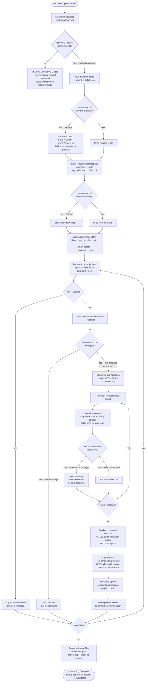

# Diagram 2 — First Time User Opens a Project

## How to run
Paste the code block below at: https://mermaid.live

```mermaid
flowchart TD
    START(["VS Code Opens Project"]) --> ACTIVATE

    ACTIVATE["Extension Activates\nonStartupFinished"] --> GIT_CHECK

    GIT_CHECK{"git config --global\nuser.email set?"}
    GIT_CHECK -->|"No"| GIT_ERR["❌ Show Error in VS Code:\nRun: git config --global user.email you@example.com\nIndexing stops"]
    GIT_CHECK -->|"Yes: nawfal@gmail.com"| HASH_EMAIL

    HASH_EMAIL["MD5 hash the email\n→ userId = b7f2a1c5..."] --> CHECK_PID

    CHECK_PID{".smart-search/\nproject-id exists?"}
    CHECK_PID -->|"No — first run"| CREATE_PID
    CHECK_PID -->|"Yes"| READ_PID

    CREATE_PID["Generate UUID\nSave to .smart-search/project-id\nAdd .smart-search/ to .gitignore"] --> BUILD_NS
    READ_PID["Read existing UUID"] --> BUILD_NS

    BUILD_NS["Build Pinecone Namespace\nprojectId :: userId\ne.g. a3f2c1d4 :: b7f2a1c5"] --> LOAD_IDX

    LOAD_IDX{".smart-search/\nindex.json exists?"}
    LOAD_IDX -->|"No — first run"| EMPTY_IDX["Start with empty index {}"]
    LOAD_IDX -->|"Yes"| READ_IDX["Load stored hashes"]
    EMPTY_IDX --> WALK
    READ_IDX --> WALK

    WALK["Walk all workspace files\nSkip: node_modules · .git · dist\n.smart-search · __pycache__ · etc."] --> FOR_FILE

    FOR_FILE["For each .py .ts .js .java\n.go .rs .c .cpp .cs .rb\n.php .swift .kt file"] --> SIZE_CHECK

    SIZE_CHECK{"File > 500KB?"}
    SIZE_CHECK -->|"Yes"| SKIP_FILE["Skip — likely minified\nor auto-generated"]
    SIZE_CHECK -->|"No"| HASH_FILE

    HASH_FILE["MD5 hash entire file content\n→ fileHash"] --> COMPARE_FILE

    COMPARE_FILE{"fileHash matches\nindex.json?"}
    COMPARE_FILE -->|"Yes — file unchanged"| SKIP_FILE2["Skip this file\n0 API calls made"]
    COMPARE_FILE -->|"No — file changed\nor first run"| CHUNK

    CHUNK["Chunk file into functions\nlocally in TypeScript\nno network call"] --> FOR_FUNC

    FOR_FUNC["For each function/class found"] --> HASH_FUNC

    HASH_FUNC["Normalize content\nstrip blank lines + trailing spaces\nMD5 hash → funcHash"] --> COMPARE_FUNC

    COMPARE_FUNC{"funcHash matches\nindex.json?"}
    COMPARE_FUNC -->|"Yes — function unchanged"| KEEP["Keep existing\nPinecone vector\nno re-embedding"]
    COMPARE_FUNC -->|"No — new or changed"| QUEUE_EMBED["Add to toEmbed list"]

    QUEUE_EMBED --> NEXT_FUNC{"More functions?"}
    KEEP --> NEXT_FUNC
    NEXT_FUNC -->|"Yes"| FOR_FUNC
    NEXT_FUNC -->|"No"| SEND_BATCH

    SEND_BATCH["Send ALL changed functions\nin ONE batch to Python /index\nwith namespace"]

    SEND_BATCH --> OPENAI["OpenAI API\ntext-embedding-3-small\nONE call for all functions\n1536-float vector each"]

    OPENAI --> PINECONE["Pinecone upsert\nscoped to namespace\nprojId :: userId"]

    PINECONE --> SAVE_IDX["Save updated hashes\nto .smart-search/index.json"]

    SAVE_IDX --> NEXT_FILE{"More files?"}
    SKIP_FILE --> NEXT_FILE
    SKIP_FILE2 --> NEXT_FILE
    NEXT_FILE -->|"Yes"| FOR_FILE
    NEXT_FILE -->|"No"| CLEANUP

    CLEANUP["Remove deleted files\nfrom index.json\nDelete their Pinecone vectors"] --> DONE

    DONE(["✅ Indexing Complete\nStatus bar: Smart Search: N files updated"])
```
