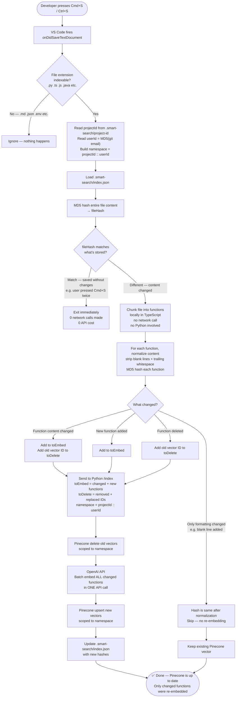

# Diagram 3 — User Saves a File (Incremental Re-indexing)

## How to run
Paste the code block below at: https://mermaid.live

```mermaid
flowchart TD
    START(["Developer presses Cmd+S / Ctrl+S"]) --> EVENT

    EVENT["VS Code fires onDidSaveTextDocument"] --> EXT_CHECK

    EXT_CHECK{"File extension\nindexable?\n.py .ts .js .java etc."}
    EXT_CHECK -->|"No — .md .json .env etc."| IGNORE["Ignore — nothing happens"]
    EXT_CHECK -->|"Yes"| BUILD_NS

    BUILD_NS["Read projectId from .smart-search/project-id\nRead userId = MD5(git email)\nBuild namespace = projectId :: userId"] --> LOAD_IDX

    LOAD_IDX["Load .smart-search/index.json"] --> HASH_FILE

    HASH_FILE["MD5 hash entire file content\n→ fileHash"] --> COMPARE_FILE

    COMPARE_FILE{"fileHash matches\nwhat's stored?"}
    COMPARE_FILE -->|"Match — saved without changes\ne.g. user pressed Cmd+S twice"| NO_CHANGE["Exit immediately\n0 network calls made\n0 API cost"]
    COMPARE_FILE -->|"Different — content changed"| CHUNK

    CHUNK["Chunk file into functions\nlocally in TypeScript\nno network call\nno Python involved"] --> COMPARE_FUNCS

    COMPARE_FUNCS["For each function, normalize content\nstrip blank lines + trailing whitespace\nMD5 hash each function"] --> DECISION

    DECISION{"What changed?"}

    DECISION -->|"Function content changed"| CHANGED["Add to toEmbed\nAdd old vector ID to toDelete"]
    DECISION -->|"New function added"| NEW["Add to toEmbed"]
    DECISION -->|"Function deleted"| DELETED["Add old vector ID to toDelete"]
    DECISION -->|"Only formatting changed\ne.g. blank line added"| UNCHANGED["Hash is same after normalization\nSkip — no re-embedding"]

    CHANGED --> SEND
    NEW --> SEND
    DELETED --> SEND
    UNCHANGED --> SKIP_FUNC["Keep existing Pinecone vector"]

    SEND["Send to Python /index\ntoEmbed = changed + new functions\ntoDelete = removed + replaced IDs\nnamespace = projectId :: userId"]

    SEND --> DELETE_OLD["Pinecone delete old vectors\nscoped to namespace"]
    DELETE_OLD --> EMBED["OpenAI API\nBatch embed ALL changed functions\nin ONE API call"]
    EMBED --> UPSERT["Pinecone upsert new vectors\nscoped to namespace"]
    UPSERT --> SAVE_IDX["Update .smart-search/index.json\nwith new hashes"]

    SAVE_IDX --> DONE(["✅ Done — Pinecone is up to date\nOnly changed functions were re-embedded"])
    SKIP_FUNC --> DONE
```
