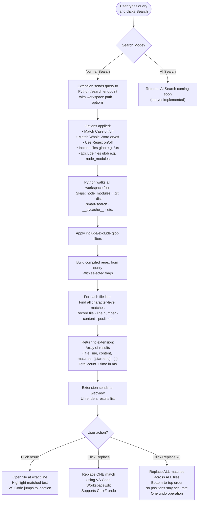

# Diagram 4 — Search Flow (Normal & AI Mode)

```mermaid
flowchart TD
    START(["User types query\nand clicks Search"]) --> MODE

    MODE{"Search Mode?"}

    MODE -->|"Normal Search"| NORMAL_SEND
    MODE -->|"AI Search"| AI_MSG["Returns: AI Search coming soon\n(not yet implemented)"]

    NORMAL_SEND["Extension sends query to\nPython /search endpoint\nwith workspace path + options"] --> OPTIONS

    OPTIONS["Options applied:\n• Match Case on/off\n• Match Whole Word on/off\n• Use Regex on/off\n• Include files glob e.g. *.ts\n• Exclude files glob e.g. node_modules"]

    OPTIONS --> WALK["Python walks all workspace files\nSkips: node_modules · .git · dist\n.smart-search · __pycache__ · etc."]

    WALK --> FILTER["Apply include/exclude glob filters"]

    FILTER --> REGEX["Build compiled regex from query\nWith selected flags"]

    REGEX --> MATCH["For each file line:\nFind all character-level matches\nRecord file · line number · content · positions"]

    MATCH --> RESULTS["Return to extension:\nArray of results\n{ file, line, content, matches: [[start,end],...] }\nTotal count + time in ms"]

    RESULTS --> RENDER["Extension sends to webview\nUI renders results list"]

    RENDER --> USER_ACTION{"User action?"}

    USER_ACTION -->|"Click result"| OPEN["Open file at exact line\nHighlight matched text\nVS Code jumps to location"]

    USER_ACTION -->|"Click Replace"| REPLACE["Replace ONE match\nUsing VS Code WorkspaceEdit\nSupports Ctrl+Z undo"]

    USER_ACTION -->|"Click Replace All"| REPLACE_ALL["Replace ALL matches\nacross ALL files\nBottom-to-top order\nso positions stay accurate\nOne undo operation"]
```
