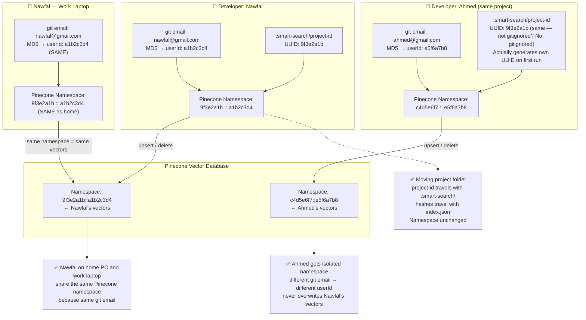

# Diagram 5 — User Identity & Project Isolation

```mermaid
flowchart TD
    subgraph DEV1["👤 Developer: Nawfal"]
        EMAIL1["git email: nawfal@gmail.com\nMD5 → userId: a1b2c3d4"]
        PID1[".smart-search/project-id\nUUID: 9f3e2a1b"]
        NS1["Pinecone Namespace:\n9f3e2a1b :: a1b2c3d4"]
    end

    subgraph DEV2["👤 Developer: Ahmed (same project)"]
        EMAIL2["git email: ahmed@gmail.com\nMD5 → userId: e5f6a7b8"]
        PID2[".smart-search/project-id\nUUID: 9f3e2a1b (same — not gitignored? No, gitignored)\nActually generates own UUID on first run"]
        NS2["Pinecone Namespace:\nc4d5e6f7 :: e5f6a7b8"]
    end

    subgraph DEV1B["👤 Nawfal — Work Laptop"]
        EMAIL1B["git email: nawfal@gmail.com\nMD5 → userId: a1b2c3d4 (SAME)"]
        NS1B["Pinecone Namespace:\n9f3e2a1b :: a1b2c3d4 (SAME as home)"]
    end

    subgraph PINECONE["Pinecone Vector Database"]
        NS_A["Namespace: 9f3e2a1b::a1b2c3d4\n← Nawfal's vectors"]
        NS_B["Namespace: c4d5e6f7::e5f6a7b8\n← Ahmed's vectors"]
    end

    EMAIL1 --> NS1
    PID1 --> NS1
    NS1 -->|"upsert / delete"| NS_A

    EMAIL2 --> NS2
    PID2 --> NS2
    NS2 -->|"upsert / delete"| NS_B

    EMAIL1B --> NS1B
    NS1B -->|"same namespace = same vectors"| NS_A

    NOTE1["✅ Nawfal on home PC and work laptop\nshare the same Pinecone namespace\nbecause same git email"]
    NOTE2["✅ Ahmed gets isolated namespace\ndifferent git email → different userId\nnever overwrites Nawfal's vectors"]
    NOTE3["✅ Moving project folder\nproject-id travels with .smart-search/\nhashes travel with index.json\nNamespace unchanged"]

    NS_A -.-> NOTE1
    NS_B -.-> NOTE2
    NS1 -.-> NOTE3
```
